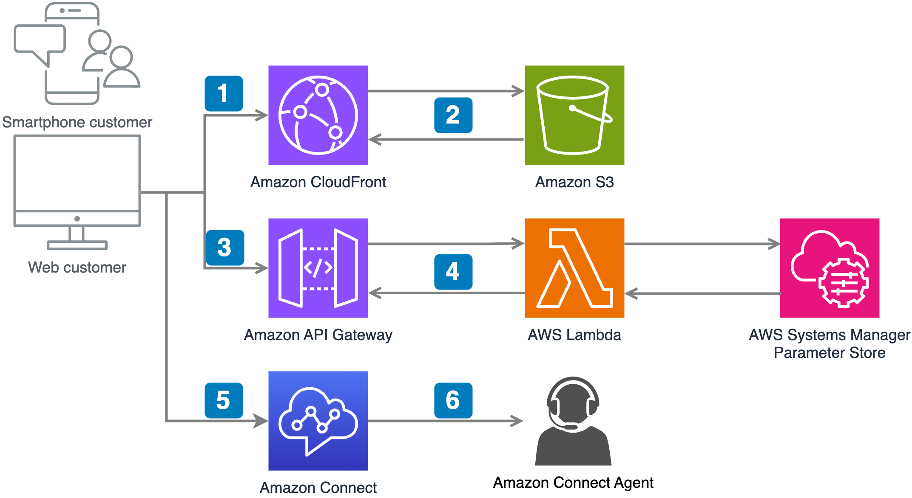

# Securely pass customer context using Amazon Connect in-app, web, and video calling

## Introduction
This project deploys a sample use case of a customer initiating web and video calls from a webpage. The website also demonstrate how to transfer customer information to agents using Amazon Connect in-app, web, and video calling.


## Architecture



1. Customer access website hosted in Amazon CloudFront
2. Static Website content is accessed on Amazon S3 (through Amazon CloudFront)
3. When Customer submits form in the static website, attributes are sent to AWS Lambda via API gateway.
4. The AWS Lambda issues JSON Web Tokens (JWTs) for new requests. AWS Lambda gets the authentication credentials from AWS Systems Manager Parameter
5. Load Amazon Connect Comm Widget Script/ The Communications Widget JavaScript that you embed on the websites enables customers to voice and video call with agents.
6. Customer and Agent are connected.


## Prerequisites

-  An AWS account with administrator access to following services – Amazon Connect, Amazon API Gateway, AWS Lambda, AWS CloudFormation, Amazon CloudFront 
-  An Amazon Connect Instance
-  AWS CLI setup in your local environment
-  AWS Cloud Development Kit (CDK)


## Installation

1. Install AWS CDK (skip if you already installed) and Bootstrap CDK environment
```bash
npm -g install typescript
npm -g install aws-cdk
cdk bootstrap aws://ACCOUNT_ID/AWS_REGION
```

2. Using Git, clone the repository from GitHub.
(Once published in github, please use the below)
```bash
git clone https://github.com/aws-samples/amazon-connect-voice-video-web-calling.git
```

3. Install the dependencies for the CDK project and AWS Lambda functions

```bash
mkdir -p lambda-layers/jwt-layer/nodejs
npm install jsonwebtoken --prefix lambda-layers/jwt-layer/nodejs
npm install
```

4. Deploy the CDK project using your AWS CLI profile. This will deploy the necessary resources in Amazon CloudFront, Amazon API Gateway, AWS Lambda and AWS System Manager for your project.

```bash
cdk deploy
```

(cdk version 2.127.0 is used for this project. If upgrade required, run `npm install -g aws-cdk --force`)

5. Once the CDK deployment has finished, navigate to `Outputs` under this stack, note down the values for Amazon API Gateway endpoint and the Amazon CloudFront website url.

`AcWebCallingStack.Endpoint8024A810 = https://aaaaaaaa.execute-api.<region>.amazonaws.com/prod/` (Your Amazon API Gateway)
`AcWebCallingStack.websiteURL =  https://aaaaaa.cloudfront.net` (Your Amazon CloudFront  website url)


## Usage
After the stack is deployed, please follow the steps outlined in blog post **Securely pass customer context to agents using Amazon Connect in-app, web, and video calling**

## Useful commands

* `npm run build`   compile typescript to js
* `npm run watch`   watch for changes and compile
* `npm run test`    perform the jest unit tests
* `cdk deploy`      deploy this stack to your default AWS account/region
* `cdk diff`        compare deployed stack with current state
* `cdk synth`       emits the synthesized CloudFormation template

## Support
Tell people where they can go to for help. It can be any combination of an issue tracker, a chat room, an email address, etc.

## Contributing
State if you are open to contributions and what your requirements are for accepting them.

For people who want to make changes to your project, it's helpful to have some documentation on how to get started. Perhaps there is a script that they should run or some environment variables that they need to set. Make these steps explicit. These instructions could also be useful to your future self.

You can also document commands to lint the code or run tests. These steps help to ensure high code quality and reduce the likelihood that the changes inadvertently break something. Having instructions for running tests is especially helpful if it requires external setup, such as starting a Selenium server for testing in a browser.

## Security
See [CONTRIBUTING](CONTRIBUTING.md#security-issue-notifications) for more information.

## License
This project is licensed under the MIT-0 License. See the [LICENSE](LICENSE) file.
